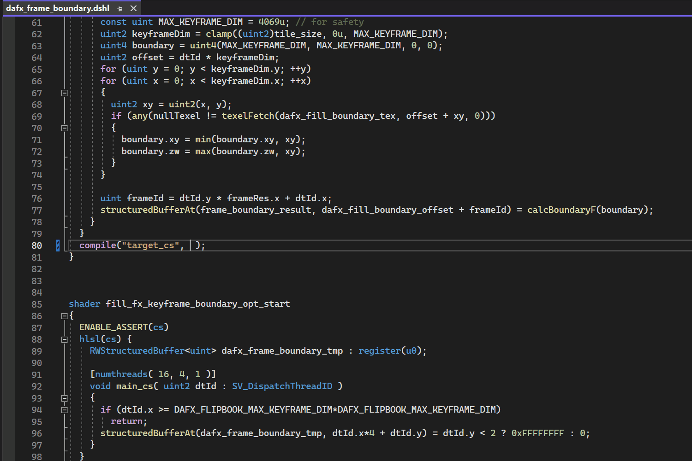

# Dagor Shader Language Support

Dagor Shader Language Support for Visual Studio.

## Features

### Syntax highlight

The extension colorizes types, variables, functions, constructors, keywords, modifiers, semantics, attributes, preprocessor directives, operators, literals, and comments.

### Code completion

The extension provides types, variables, functions, constructors, keywords, modifiers, semantics, attributes, preprocessor directives, code snippets, and DSHL macros using IntelliSense, according to the context. It can also give you a quick summary about the item when available.

### Signature help

The extension can display a signature helper for DSHL macros.

### Document highlights

The extension can highlight all the occurrences of the selected DSHL macro in the file.

### Hover

The extension can provide useful information if you hover over DSHL macros.

### Document symbols

The extension can provide breadcrumbs about the DSHL macros.

### Go to / Peek definitions

You can find (go to / peek) the definition of a DSHL macro.

### Go to declarations

You can find the declaration of a DSHL macro.

### Go to implementations

You can find the implementation of DSHL macro.

### Comment toggling

### Bracket matching

### Auto closing pairs

### Indentation

### File icons

## Issues

If you have any problems or feature request for the extension, feel free to create an issue.

## Release Notes

For more information, see the [changelog](CHANGELOG.md).

### 1.1.0

- Code completion (for built-in items, and DSHL macros)
- Signature help (for DSHL macros)
- Document highlights (for DSHL macros)
- Hover (for DSHL macros)
- Document symbols (for DSHL macros)
- Go to definition (for DSHL macros)
- Go to declaration (for DSHL macros)
- Go to implementation (for DSHL macros)
- Several bugfixes and optimizations

### 1.0.0

- Syntax highlight
- Comment toggling
- Bracket matching
- Auto closing pairs
- Indentation
- File icons
