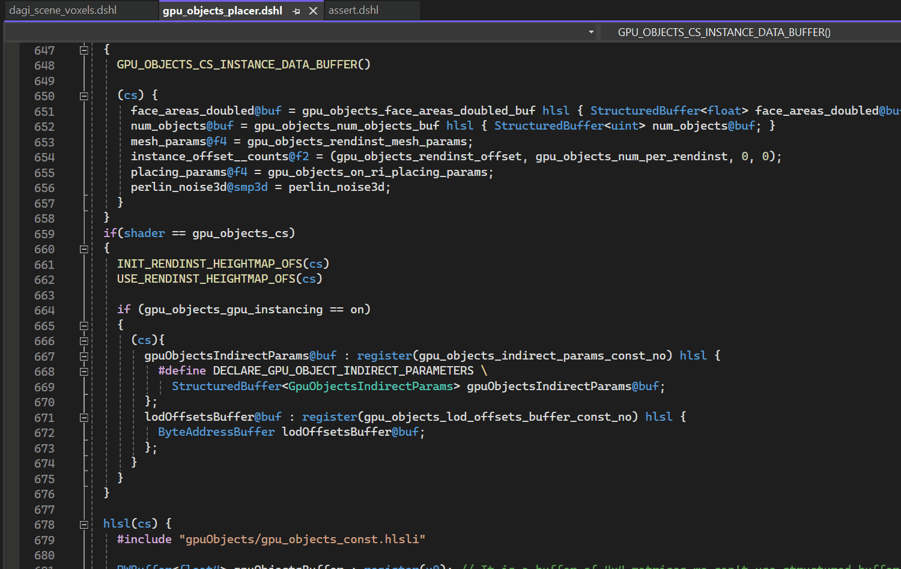
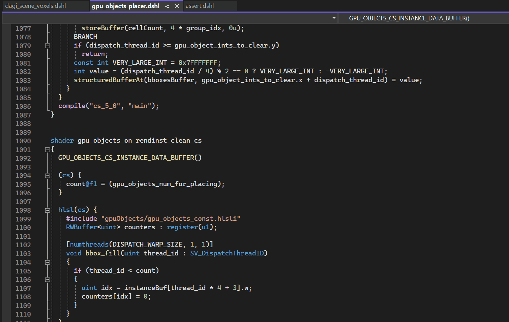

# Dagor Shader Language Support

Dagor Shader Language Support for Visual Studio.

## Features

### Syntax highlight

The extension colorizes types, variables, functions, constructors, keywords, modifiers, semantics, attributes, preprocessor directives, operators, literals, and comments.

### Diagnostics

The extension can show compile time errors or warnings when you open or save a file.

### Code completion

The extension provides types, variables, functions, constructors, keywords, modifiers, semantics, attributes, shaders, block statements, preprocessor directives, code snippets, DSHL macros, and HLSL defines using IntelliSense, according to the context. It can also give you a quick summary about the item when available.

### Signature help

The extension can display a signature helper for DSHL functions, and macros.

### Document highlights

The extension can highlight all the occurrences of the selected DSHL variable, function, shader, block statement, macro or HLSL define in the file.

### Hover

The extension can provide useful information if you hover over DSHL variables, functions, shaders, block statements, macros or HLSL defines.

### Document symbols

The extension can provide outline information and breadcrumbs about DSHL variables, shaders, block statements, macros and HLSL defines.

### Formatting

The extension can format the whole document, or the selected region.

### Go to / Peek definitions

You can find (go to / peek) the definition of a DSHL variable, function, shader, block statement, macro, HLSL define, or to the included file.

### Go to declarations

You can find the declaration of a DSHL variable, function, shader, block statement, macro, HLSL define, or to the included file.

### Go to implementations

You can find the implementation of DSHL function, shader, block statement, macro, HLSL define, or to the included file.

### Comment toggling

### Bracket matching

### Auto closing pairs

### Indentation

### File icons

## Issues

If you have any problems or feature request for the extension, feel free to create an issue.

## Release Notes

For more information, see the [changelog](CHANGELOG.md).

### 1.5.0

-   Diagnostics
-   Code formatting
-   Includes work with go to declaration/definition/implementation
-   Other smaller improvements

### 1.3.0

-   Code completion (for DSHL variables, shaders, and block statements)
-   Document highlights (for DSHL variables, functions, shaders, and block statements)
-   Hover (for DSHL variables, functions, shaders, and block statements)
-   Document symbols (for DSHL variables, shaders, and block statements)
-   Signature help (for DSHL functions)
-   Go to definition (for DSHL variables, functions, shaders, and block statements)
-   Go to declaration (for DSHL variables, functions, shaders, and block statements)
-   Go to implementation (for DSHL functions, shaders, and block statements)
-   Adding folding ranges based on blocks
-   Several improvements, bugfixes and optimizations

### 1.2.0

- Code completion (for HLSL defines, include statements, DSHL macro parameters)
- Document highlights (for HLSL defines, DSHL macro parameters)
- Hover (for HLSL defines)
- Document symbols (for HLSL defines)
- Go to definition (for HLSL defines, DSHL macro parameters)
- Go to declaration (for HLSL defines, DSHL macro parameters)
- Go to implementation (for HLSL defines)
- Several bugfixes and optimizations

### 1.1.0

- Code completion (for built-in items, and DSHL macros)
- Signature help (for DSHL macros)
- Document highlights (for DSHL macros)
- Hover (for DSHL macros)
- Document symbols (for DSHL macros)
- Go to definition (for DSHL macros)
- Go to declaration (for DSHL macros)
- Go to implementation (for DSHL macros)
- Several bugfixes and optimizations

### 1.0.0

- Syntax highlight
- Comment toggling
- Bracket matching
- Auto closing pairs
- Indentation
- File icons
